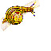
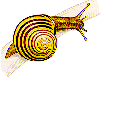
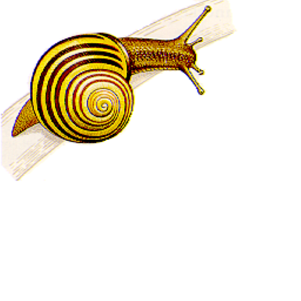
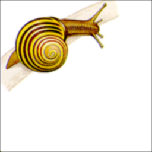
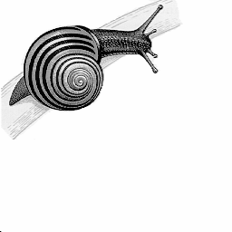
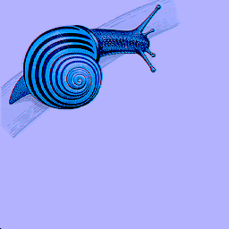
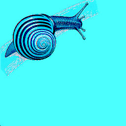
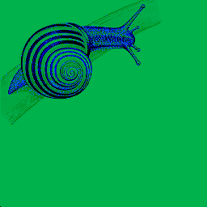

# Image Processing Project

Welcome to my personal image processing project! This repository showcases my skills and experience as a C++ developer, specifically in the domain of image processing. The project demonstrates various image manipulation techniques, such as adjusting brightness, contrast, resizing, applying blur, and applying color filters.

The implemented methods include Gaussian blur for blurring images and bilinear interpolation for resizing. The project aims to display my proficiency in C++ and image processing, serving as a portfolio piece for potential employers.

## Features

The project includes the following image processing techniques:

- Brightness Adjustment
- Contrast Adjustment
- Image Resizing (using bilinear interpolation)
- Blurring (using Gaussian blur)
- Greyscale Conversion
- Color Filters

## Dependencies

- C++14 or higher
- A modern C++ compiler (e.g., GCC, Clang, or Visual Studio)

## Getting Started

1. Clone the repository:

```
git clone https://github.com/ChinhTranKaizen/ImageProcessing
```

2. Navigate to the project directory:

```
cd ImageProcessing
```

3. Compile the project:

```
g++ -std=c++14 -o ImageProcessing main.cpp
```

4. Run the executable:

```
./ImageProcessing.exe
```

## Examples
1. Snail brothers (resizing)






2. Near sighted snails (Gaussian blur)





3. Grey snail (to greyscale)



4. Marilyn snail (color filter)





The repository also includes a folder named `examples` that contains sample images, demonstrating the results of applying various image processing techniques to the same input image. The folder is organized by technique, with subfolders for brightness, contrast, resizing, blurring, greyscale, and color filters.

## Contributing

While this is a personal project, I welcome any feedback or suggestions for improvement. Please feel free to open an issue or submit a pull request.

## License

This project is licensed under the MIT License - see the [LICENSE](LICENSE) file for details.

## Acknowledgments

- Thanks to the C++ community for providing extensive resources and tutorials on image processing techniques.
- Thanks to the various authors of articles and blog posts that helped me better understand and implement Gaussian blur and bilinear interpolation algorithms.
